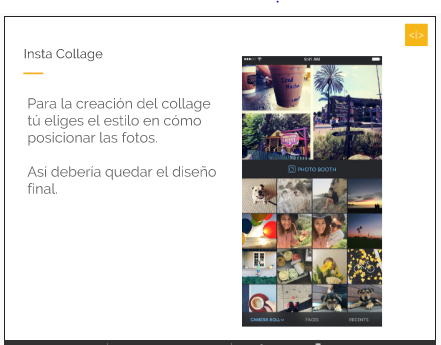

# Insta Collage

;

## Requerimientos
- Uso de API Drag and Drop de HTML5
- Crear Collage arrastrando y soltando las imagenes
- El minimo de fotos para elegir debe ser 6 y para el collage minimo son 3

## Equipo
- Andrea Isabel Chumioque
- Lidia Ramirez